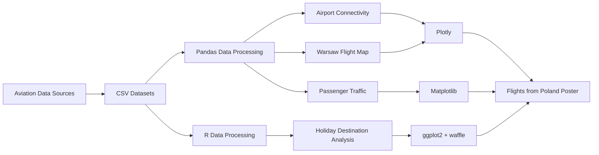

# Flights from Poland


A data analysis and visualization project exploring **commercial aviation in Poland** — from airport connectivity and passenger traffic to international routes, flight frequencies, and holiday destinations.

The project combines data from several aviation and geographical sources and transforms it into a set of visualizations used to create the final **Flights from Poland** infographic.

📄 **[View the final Flights from Poland report](https://github.com/user-attachments/files/31486851/Domanowski_Mulewicz_OIszewska.pdf)**

---

## About the Project

How connected are Polish airports? Which airports handle the most passengers? Where can you fly directly from Warsaw? And which countries dominate summer travel?

**Flights from Poland** was created to answer these questions through exploratory data analysis and visual storytelling.

The project investigates several dimensions of the Polish aviation network:

- number of routes available from major airports,
- number of airlines operating at each airport,
- passenger traffic between 2022 and 2024,
- frequency of direct flights from Warsaw across Europe,
- geographical distribution of flight destinations,
- most popular holiday destinations,
- longest routes departing from Poland,
- and selected aviation-related insights.

The final result combines Python and R visualizations into a single infographic presenting the Polish aviation landscape in an accessible form.

---

## Key Findings

### Warsaw is Poland's largest aviation hub

Warsaw Chopin Airport leads the analyzed airports with:

- **141 routes**
- **36 airlines**

Kraków Airport follows closely with:

- **131 routes**
- **33 airlines**

Among the five analyzed airports:

| Airport | Routes | Airlines |
| :--- | ---: | ---: |
| Warsaw (WAW) | 141 | 36 |
| Kraków (KRK) | 131 | 33 |
| Gdańsk (GDN) | 76 | 12 |
| Wrocław (WRO) | 72 | 11 |
| Katowice (KTW) | 57 | 8 |

---

### Passenger traffic continues to grow

Passenger volumes increased significantly between **2022 and 2024** across all five major airports included in the analysis.

| Airport | 2022 | 2023 | 2024 |
| :--- | ---: | ---: | ---: |
| Warsaw | 14.39 M | 18.47 M | **21.26 M** |
| Kraków | 7.39 M | 9.40 M | **11.07 M** |
| Gdańsk | 4.56 M | 5.90 M | **6.70 M** |
| Katowice | 4.41 M | 5.59 M | **6.36 M** |
| Wrocław | 2.87 M | 3.88 M | **4.47 M** |

Warsaw Chopin Airport remained the dominant airport throughout the analyzed period and exceeded **21 million passengers in 2024**.

---

### Europe is highly connected with Warsaw

Direct flights departing from **Warsaw Chopin Airport (WAW)** were aggregated at country level to visualize the frequency of connections across Europe.

Countries are classified into four daily-flight frequency groups:

```text
30–40 flights/day
20–30 flights/day
10–20 flights/day
0–10 flights/day
```

Countries outside the target European region or without connections are displayed separately.

The resulting choropleth provides a geographical overview of how strongly Warsaw is connected to different parts of Europe.

---

### Greece dominates holiday travel

Holiday flight data shows Greece as the strongest individual destination category in the analyzed summer connections.

The visualization groups the most popular countries individually and combines less frequent destinations into an **Other** category.

The eight highest-ranked countries in the dataset are:

1. Greece
2. Italy
3. Turkey
4. Croatia
5. Spain
6. Bulgaria
7. Albania
8. United Kingdom

The final poster additionally highlights the scale of Polish-Greek connectivity, with flights operating between multiple Polish airports and Greek destinations.

---

## Visualizations

The repository contains separate scripts for the major components of the final infographic.

### Passenger Traffic

**File:** `airportsVSpassengers.py`

Creates a grouped bar chart showing passenger traffic at the five largest analyzed Polish airports between **2022 and 2024**.

The visualization uses:

- Pandas for tabular data management,
- Matplotlib for plotting,
- custom million-passenger axis formatting,
- a dark background matching the visual identity of the final poster.

---

### Direct Flights from Warsaw

**File:** `choropleth.py`

Creates an interactive Plotly choropleth showing the geographical distribution of direct connections from Warsaw.

The pipeline:

1. Loads airport, flight and country metadata.
2. Selects flights departing from `WAW`.
3. Maps destination IATA codes to countries.
4. Restricts the analysis primarily to Europe.
5. Converts flight-frequency ranges into numerical values.
6. Aggregates daily flights at country level.
7. Assigns countries to frequency bins.
8. Visualizes the result using ISO-3 country codes.
9. Marks Warsaw Chopin Airport directly on the map.

The map uses a Mercator projection centered around Warsaw.

---

### Routes and Airlines per Airport

**File:** `routes_and_airlines.py`

Compares airport connectivity using two complementary variables:

- **horizontal bars** — number of routes,
- **line + markers** — number of airlines.

This makes it possible to compare not only the number of destinations served by each airport, but also the diversity of carriers providing those connections.

The visualization is implemented using **Plotly Graph Objects**.

---

### Holiday Destination Waffle Chart

**File:** `waffle_chart.R`

Uses **R**, `ggplot2`, and `waffle` to transform holiday-flight counts into a 100-tile waffle visualization.

The script:

- ranks destinations by number of flights,
- selects the eight largest categories,
- groups the remaining countries into `Other`,
- converts raw counts into percentages,
- converts percentages into integer tile counts,
- ensures the final visualization contains exactly 100 tiles.

This provides an intuitive representation of the relative popularity of summer destinations.

---

### Data Preparation

**File:** `data_gathering.py`

Provides a lightweight preprocessing utility for converting source CSV datasets into serialized Pandas objects.

The script processes:

```text
iata-icao.csv
airports.csv
flights_dataset.csv
```

and generates:

```text
iata-icao_airports.pkl
airports.pkl
flights.pkl
```

Pickle serialization can be used to reduce repeated CSV parsing during exploratory analysis.

---

## Analysis Pipeline



---

## Repository Structure

```text
flights_analysis/
│
├── README.md
│
├── airportsVSpassengers.py
│   └── Passenger traffic visualization for 2022–2024
│
├── choropleth.py
│   └── European direct-flight frequency map from Warsaw
│
├── data_gathering.py
│   └── CSV → Pandas Pickle preprocessing
│
├── routes_and_airlines.py
│   └── Airport routes and airline comparison
│
├── waffle_chart.R
│   └── Holiday destination waffle chart
│
└── data/                         # recommended location for source datasets
    ├── iata-icao.csv
    ├── airports.csv
    ├── flights_dataset.csv
    └── countries_continent_codes.csv
```

> **Note:** The current Python scripts use relative file paths. If the datasets are moved into a `data/` directory, the paths inside the scripts should be updated accordingly.

---

## Tech Stack

| Area | Technology |
| :--- | :--- |
| **Programming** | Python, R |
| **Data Processing** | Pandas, NumPy |
| **Python Visualization** | Plotly, Matplotlib |
| **R Visualization** | ggplot2, waffle |
| **Geospatial Visualization** | Plotly Choropleth / Scattergeo |
| **Data Formats** | CSV, Pickle |
| **Geographical Identifiers** | IATA, ICAO, ISO-2, ISO-3 |
| **Final Output** | Data Visualization Poster / PDF |

---

## Data Sources

The project uses publicly available aviation and geographical information.

### Polish Civil Aviation Authority — ULC

Passenger statistics and information about Polish airports.

https://ulc.gov.pl

### FlightsFrom

Airport connectivity, airlines, routes and direct-flight information.

https://www.flightsfrom.com

### IP2Location IATA / ICAO Database

Airport metadata used to connect airport codes with geographical locations and country information.

https://github.com/ip2location/ip2location-iata-icao

Additional local lookup tables are used to map countries to continents and standard ISO country codes.

---

## Installation

### 1. Clone the repository

```bash
git clone https://github.com/YOUR_USERNAME/flights_analysis.git
cd flights_analysis
```

Replace `YOUR_USERNAME` with the appropriate GitHub username.

---

### 2. Install Python dependencies

Python **3.9+** is recommended.

```bash
pip install pandas numpy matplotlib plotly
```

Alternatively, create a virtual environment first:

```bash
python -m venv .venv
source .venv/bin/activate
pip install pandas numpy matplotlib plotly
```

On Windows:

```bash
.venv\Scripts\activate
```

---

### 3. Install R dependencies

Start R and install:

```r
install.packages(c(
  "ggplot2",
  "dplyr",
  "waffle"
))
```

The waffle analysis uses `dplyr` operations such as `arrange()`, `slice()` and `summarise()`, so the package must also be available in the R environment.

---

## Required Data

For the complete analysis, the following local datasets are expected:

```text
iata-icao.csv
airports.csv
flights_dataset.csv
countries_continent_codes.csv
```

The choropleth script expects the relevant CSV files to be accessible through relative paths.

In particular:

```python
pd.read_csv("iata-icao.csv")
pd.read_csv("flights_dataset.csv")
pd.read_csv("countries_continent_codes.csv")
```

If you organize the datasets inside a dedicated `data/` directory, change these paths accordingly.

---

## Running the Analysis

### Airport routes and airlines

```bash
python routes_and_airlines.py
```

Produces an interactive comparison of routes and airlines for major Polish airports.

---

### Passenger traffic

```bash
python airportsVSpassengers.py
```

Produces the passenger traffic chart for 2022–2024.

---

### Warsaw choropleth

Make sure the required CSV datasets are present, then run:

```bash
python choropleth.py
```

An interactive Plotly map will open showing direct-flight intensity across Europe.

---

### Data preprocessing

```bash
python data_gathering.py
```

Creates serialized Pandas datasets:

```text
iata-icao_airports.pkl
airports.pkl
flights.pkl
```

---

### Holiday destination analysis

```bash
Rscript waffle_chart.R
```

Generates the holiday destination waffle visualization.

---

## Methodology

### Airport connectivity

Airport connectivity is evaluated using:

\[
C_i = (R_i, A_i)
\]

where:

- \(R_i\) is the number of routes available from airport \(i\),
- \(A_i\) is the number of airlines operating from airport \(i\).

This allows airports with similar route counts but different airline diversity to be distinguished.

---

### Passenger growth

Passenger traffic is compared year-to-year for each airport:

\[
\Delta P_t = P_t - P_{t-1}
\]

where \(P_t\) represents the number of passengers handled during year \(t\).

The data covers:

```text
2022 → 2023 → 2024
```

and demonstrates the post-pandemic growth of passenger demand across the analyzed airports.

---

### Country-level flight frequency

For flights originating at Warsaw Chopin Airport, destination airports are mapped to their respective countries.

Country-level connectivity is then calculated as:

\[
F_c = \sum_{i \in c} f_i
\]

where:

- \(f_i\) is the estimated daily flight frequency to destination airport \(i\),
- \(F_c\) is the aggregated flight frequency for country \(c\).

These totals are discretized into frequency bins and visualized geographically.

---

### Holiday destination distribution

Let \(n_c\) denote the number of holiday connections associated with country \(c\).

The relative contribution of a destination is:

\[
p_c = \frac{n_c}{\sum_j n_j} \times 100
\]

The values are converted into integer tile counts while preserving a total of exactly **100 tiles**.

---

## Design

The visualizations share a consistent design language developed for the final infographic:

- dark background,
- blue quantitative scale,
- high-contrast typography,
- minimal axes and grid lines,
- pink accent elements,
- compact labels,
- visual hierarchy optimized for poster presentation.

The goal was not only to analyze the aviation data, but also to transform the results into a coherent **data story**.

---

## Interesting Aviation Insights

The final poster also highlights several observations discovered during the project.

### 🇯🇵 Warsaw → Tokyo

The Warsaw–Tokyo route covers approximately **8,900 km**, making it one of the longest connections included in the analysis.

### 🇹🇭 Warsaw → Krabi

The route covers more than **8,200 km** and crosses approximately eight time zones.

### 🇺🇸 Warsaw → Miami

Because passengers travel west across several time zones, the local arrival time can still fall before sunset despite the duration of the flight.

### 🎬 Long-haul travel

The longest routes departing from Poland exceed **11.5 hours**, illustrating the scale of Poland's long-distance aviation network.

### 🇬🇷 Greece

Greece stands out as one of the most important summer destinations in the analyzed data, with a broad network of connections from several Polish airports.

---

## Reproducibility Notes

Some datasets are currently embedded directly in individual visualization scripts, while others are loaded from external CSV files.

Specifically:

- airport routes and airline counts are defined directly in `routes_and_airlines.py`,
- passenger statistics are defined directly in `airportsVSpassengers.py`,
- holiday destination counts are defined directly in `waffle_chart.R`,
- geographical flight analysis is generated dynamically from CSV datasets in `choropleth.py`.

The repository therefore represents both the **analysis code used for the poster** and the processed values used to reproduce its visual elements.

For a fully automated pipeline, these hard-coded datasets could later be moved into a common `data/` layer and loaded programmatically by each visualization script.

---

## Possible Extensions

Future development could include:

- automated retrieval of current flight schedules,
- historical passenger trend analysis over longer periods,
- airport-level interactive dashboards,
- seasonal route comparisons,
- domestic vs. international flight analysis,
- airline market-share analysis,
- network graphs of airport connectivity,
- route-distance distributions,
- CO₂ emission estimates,
- delay and punctuality statistics,
- interactive filtering by airport, airline, country and season,
- migration of all source data into a unified reproducible pipeline.

---

## Final Report

The final visualization produced using this analysis is available here:

### **[Flights from Poland — Full PDF](https://github.com/user-attachments/files/31486851/Domanowski_Mulewicz_OIszewska.pdf)**

The poster combines:

- airport connectivity,
- passenger statistics,
- European route geography,
- holiday travel patterns,
- long-haul route information,
- and selected aviation facts

into a single visual overview of **air travel from Poland**.

---

## Authors

**Bartłomiej Domanowski**  
**Aleksandra Mulewicz**  
**Emilia Olszewska**

---

<p align="center">
  <b>Flights from Poland </b><br>
  Exploring Polish aviation through data.
</p>
